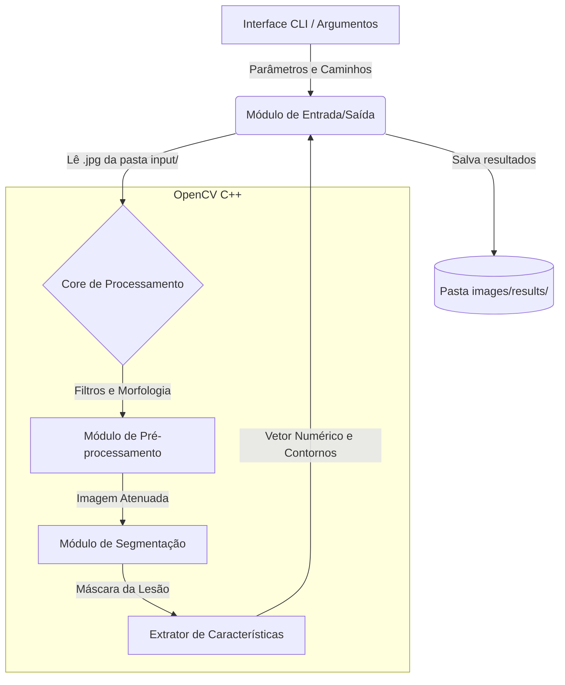

# Proposta
**Integrantes:**
* Gabriel Victor Garcia Teixeira
* Gustavo Pedrini
* Henrik Baltazar
Neste documento é abordada a proposta de projeto da disciplina de Processamento Digital de Imagens.

## Problema

- O problema investigado consiste na dificuldade e na subjetividade inerentes à inspeção visual humana para a triagem inicial do melanoma, a forma mais letal de câncer de pele.

- **Por que envolve processamento de imagens:** O desafio exige a manipulação de matrizes de pixels brutas de fotografias dermatoscópicas, que frequentemente apresentam ruídos (como pelos sobrepostos e reflexos de iluminação) e transições de cor difusas. É necessário aplicar algoritmos matemáticos e morfológicos para limpar a imagem e isolar a região de interesse.

- Situação inicial: O sistema recebe como ponto de partida imagens coloridas (RGB) de lesões de pele, contendo tanto a anomalia (nevo ou melanoma) quanto a pele sadia ao redor, além de possíveis artefatos visuais.

- Informação produzida: O software deverá produzir, a partir da imagem original, o contorno exato da lesão (máscara de segmentação) e um conjunto de valores numéricos que representam descritores morfológicos (assimetria, compacidade, área) e cromáticos da mancha.

## Contexto de aplicação

A solução será aplicada no contexto de triagem clínica e auxílio ao diagnóstico dermatológico.

Como o melanoma possui alta taxa de cura quando detectado precocemente, mas compartilha características visuais muito sutis com pintas comuns (nevos benignos) em seus estágios iniciais, o software atuará como uma ferramenta de suporte à decisão ("segunda opinião computacional"). Embora não substitua a biópsia, o sistema processará grandes lotes de imagens padronizadas para fornecer aos profissionais de saúde dados quantitativos precisos que confirmem ou destaquem o polimorfismo, a assimetria e a heterogeneidade da lesão, otimizando o encaminhamento de pacientes para exames mais invasivos.

Para dar sustentação a aplicação, o projeto utiliza um [conjunto de dados público no Kaggle](https://www.kaggle.com/datasets/bhaveshmittal/melanoma-cancer-dataset/data), denominado *Melanoma Cancer Dataset*. Este conjunto inicial atende aos requisitos de experimentação e viabilidade do projeto e é composto por 13.900 imagens dermatoscópicas coloridas (RGB). As amostras estão padronizadas em uma resolução de $224 \times 224$ pixels, disponibilizadas no formato `.jpg`. Todo o acervo encontra-se devidamente rotulado, dividindo as fotografias entre lesões benignas (nevos) e malignas (melanoma). O dataset não possui restrições severas de uso, estando disponível publicamente para fins educacionais e de pesquisa científica, o que garante o acesso livre e a viabilidade contínua da proposta ao longo das próximas etapas.

## Objetivo

- **Objetivo Geral:**
Desenvolver um sistema automatizado capaz de segmentar lesões cutâneas em imagens dermatoscópicas digitais e extrair características quantitativas de forma e cor para viabilizar a diferenciação computacional entre nevos benignos e melanomas.

- **Objetivos Específicos:**

   - Atenuar ruídos e remover computacionalmente artefatos da pele utilizando operações morfológicas. Algumas imagens possuem artefatos inesperados, distorção de lente e outros ruídos que precisam ser tratados antecipadamente, por exemplo:

<table align="center">
  <tr>
    <td align="center">
      
       
      <i>Exemplo de imagem com presença de pelos sobrepostos</i>
    </td>
    <td align="center">
      
       
      <i>Exemplo de imagem com distorção de lente e ruídos</i>
    </td>
  </tr>
</table>

   - Segmentar a área da lesão (frente) da pele sadia (fundo) aplicando técnicas de limiarização e detecção de contornos.

   - Calcular descritores matemáticos de forma da região segmentada (área, perímetro, compacidade de bordas e índices de assimetria).

   - Extrair métricas de dispersão cromática nos espaços de cor adequados para avaliar a heterogeneidade da mancha.

## Entrada e saída esperada

**Entrada:** Imagem (.jpg) colorida contendo lesões cutâneas benignas ou malignas, com resolução de $224 \times 224$ pixels.

**Saída esperada:** 
 - Imagem intermediária demonstrando o contorno traçado sobre a imagem original.

 - Vetor de características contendo os valores numéricos extraídos (assimetria, compacidade, área), que será utilizado por um modelo que irá classificar as lesões como benignas ou malignas.

### Pipeline conceitual:

#### Etapa 1: Aquisição e Leitura Padronizada

- Finalidade: Carregar a imagem dermatoscópica, validar sua integridade e uniformizar as dimensões na matriz do openCV.
- Técnicas consideradas: Leitura matricial, conversão implícita BGR -> RGB e verificação de canal
- Informação recebida: arquivo de imagem(jpg) em 224 x 224 pixels 
- Informação produzida: Matriz de pixels normalizadas
- Principais dúvidas: A resolução fixa de 224 x 224 do dataset pode suavizar detalhes finos de borda em lesões pequenas 

---

#### Etapa 2: Pré-processamento e Remoção de Artefatos

- Finalidade: Eliminar ruídos críticos que degradam a segmentação, especialmente pelos sobrepostos (frequentes na derme) e reflexos especulares de lente/gel dermatoscópico.
- Técnicas consideradas: 
   1. Detecção de Pelos: Operações morfológica Black-Hat com elemento estruturante cuniforme ou em linha em múltiplos ângulos para destacar estruturas escuras finas e alongadas
   2. *Interpolação de Pelos:* Algoritmo de *Inpainting* (usando o método de Telea baseado em marching rápido ou método de Navier-Stokes) para preencher a máscara dos pelos com a textura da pele subjacente.
   3. *Filtragem Espacial:* Filtro Bilateral para atenuar o ruído da textura da pele sadia sem desfocar as bordas nítidas da lesão.
   4. *Espaços de Cor:* Transformação para $L^*a^*b^*$ (separando luminância de cromaticidade) e $HSV$.
- Informação recebida: Imagem RGB com ruídos e pelos sobrepostos.
- Informação produzida: Imagem tratada livre de pelos e representações nos espaços $RGB$, $L^*a^*b^*$ e $HSV$.
- Principais dúvidas: Qual raio de inpainting remove pelos grossos sem criar manchas artificiais que possam falsear a extração de textura?

---

#### Etapa 3: Segmentação da Lesão (Região de Interesse - ROI)
* **Finalidade:** Isolar com máxima fidelidade os pixels pertencentes à lesão melanocítica (primeiro plano) da pele saudável circundante (fundo).
* **Técnicas e Alternativas em Investigação:**
  * *Alternativa A (Limiarização de Otsu):* Binarização automática calculada sobre o canal de maior contraste (ex.: canal $L^*$ invertido do $L^*a^*b^*$ ou canal Azul do RGB).
  * *Alternativa B (GrabCut Iterativo):* Segmentação baseada em corte de grafos, inicializada com retângulo central descartando as bordas externas.
  * *Alternativa C (Watershed com Marcadores):* Transformada de distância euclidiana para identificar sementes centrais da lesão e fundo.
* **Pós-processamento da Máscara:** Aplicação de Fechamento Morfológico e filtro de componentes conexos para reter apenas o maior objeto central e eliminar pequenas ilhas de falso-positivo.
* **Informação recebida:** Canais de cor filtrados.
* **Informação produzida:** Máscara binária $M(x,y) \in \{0, 1\}$ e contorno vetorial da lesão.
* **Principais dúvidas/incertezas:** Como garantir que a máscara não sofra com bordas difusas (transições graduais) típicas de melanomas iniciais?

---

#### Etapa 4: Extração de Características Quantitativas (Regra ABCD de PDI)
* **Finalidade:** Traduzir os contornos e os pixels internos da lesão em métricas matemáticas reproduzíveis para alimentar os modelos de decisão.
* **Descritores Matemáticos Considerados:**
  1. **A - Assimetria (Asymmetry):**
     * Cálculo dos eixos principais de inércia via Momentos Centrais ($\mu_{20}, \mu_{02}, \mu_{11}$) e PCA;
     * Cálculo da área de não-sobreposição após dobrar a máscara sobre os eixos maior e menor;
     * Momentos Invariantes de Hu.
  2. **B - Irregularidade de Borda (Border Irregularity):**
     * Índice de Compacidade: $C = \frac{P^2}{4 \pi A}$ (onde $P$ é o perímetro e $A$ é a área);
     * Fator de Forma / Circularidade: $4 \pi A / P^2$;
     * Variância radial da distância do centroide aos pontos do contorno.
  3. **C - Variação Cromática (Color Variegation):**
     * Média, variância e desvio-padrão dos canais nos espaços $RGB$, $L^*a^*b^*$ e $HSV$;
     * Histograma de cores e contagem de clusters cromáticos distintos (quantificação de tons pretos, castanhos, avermelhados e azul-esbranquiçados).
  4. **D - Dimensões e Diâmetro (Diameter / Geometry):**
     * Área total em pixels, diâmetro equivalente e elipse de melhor ajuste.
* **Informação recebida:** Máscara binária da lesão e imagem original sem pelos.
* **Informação produzida:** Vetor de características numéricas $\vec{x} = [f_1, f_2, \dots, f_k] \in \mathbb{R}^k$.
* **Principais dúvidas/incertezas:** Quais descritores fornecerão maior separabilidade linear ou não-linear entre nevos atípicos e melanomas reais?

---

#### Etapa 5: Geração de Dados e Classificação
* **Finalidade:** Mapear o vetor de características em um diagnóstico computacional probabilístico de benignidade vs. malignidade.
* **Técnicas consideradas:**
  * *TDS (Total Dermoscopy Score):* Pontuação ponderada clínica baseada na fórmula clássica do ABCD;
  * *Classificadores Tradicionais (OpenCV ML):* Máquinas de Vetores de Suporte com kernel RBF, e Florestas Aleatórias.
* **Informação recebida:** Vetor de características numérico normalizado.
* **Informação produzida:** Rótulo preditivo (`Benigno` ou `Melanoma`) acompanhado de métricas de avaliação (Sensibilidade, Especificidade, Acurácia e Matriz de Confusão).
* **Principais dúvidas/incertezas:** Como calibrar o limiar de decisão do classificador para priorizar a Sensibilidade (minimizando falsos negativos, que são críticos na área médica)?

**Arquitetura desejada:**
  ## Arquitetura Preliminar da Solução

Como o sistema será desenvolvido em C++ utilizando a biblioteca OpenCV, a arquitetura preliminar adota um modelo modular focado em execução via interface de linha de comando (CLI). Essa abordagem permite processar imagens em lote de forma eficiente e facilita a automatização de testes futuros. 

A organização conceitual dos componentes segue a estrutura abaixo:

## Estudo Inicial de Viabilidade

Para demonstrar que o projeto possui fundamentação sólida e é plenamente executável ao longo das etapas M1, M2 e M3, o grupo realizou uma investigação prévia combinando inspeção visual de dados, revisão de literatura técnica consagrada e análise de capacidade das ferramentas computacionais escolhidas.

### 1. Inspeção Qualitativa e Evidências Visuais do Dataset
A análise manual de amostras extraídas do *Melanoma Cancer Dataset* evidenciou os principais padrões e desafios práticos que o sistema enfrentará:
* **Tratamento de Artefatos de Pelos (Amostra `7280.jpg`):**
  A inspeção revelou que pelos escuros criam variações bruscas de intensidade que quebram a continuidade do contorno da lesão. Ficou evidente que a binarização direta falha nesses cenários, comprovando a viabilidade e a necessidade de aplicar a técnica de *Black-Hat* morfológico acoplada ao algoritmo de *Inpainting* antes de qualquer tentativa de segmentação.
  
* **Identificação de Bordas da Lente / Vinhetamento (Amostra `6068.jpg`):**
  Identificou-se a presença de cantos escurecidos e distorções circulares nas extremidades decorrentes do anel do dermatoscópio. A viabilidade de tratar esse ruído reside no fato de que a lesão de interesse situa-se majoritariamente na região central, permitindo descartar componentes periféricos via análise de componentes conexos ou máscaras de restrição central.
* **Diferenciação Visual entre Benignos e Malignos:**
  A comparação visual direta entre nevos benignos e melanomas confirmou a manifestação prática do polimorfismo: nevos tendem a apresentar contornos uniformes, elípticos e pigmentação homogênea, enquanto melanomas manifestam bordas serrilhadas e assimetria acentuada, validando a hipótese de que descritores geométricos e de momento (como Hu Moments e Compacidade) terão poder discriminatório.

---
### 2. Fundamentação na Literatura Técnica e Trabalhos Relacionados
A abordagem proposta não parte de intuições empíricas isoladas, mas baseia-se em metodologias validadas pela literatura científica de dermatologia e visão computacional:
* **Critério ABCD de Dermatoscopia (Stolz et al., 1994):** O sistema traduz computacionalmente a regra clínica mais utilizada no mundo para triagem de melanoma (*Asymmetry, Border irregularity, Color variegation, Diameter*), assegurando que os atributos extraídos possuam correlação direta com a malignidade biológica.
* **Remoção de Pelos por Morfologia Matemática (Lee et al., 1997 - *DullRazor*):** O clássico algoritmo *DullRazor* comprova que operações morfológicas de fechamento/Black-Hat seguidas de interpolação bilinear ou inpainting são altamente eficazes para restauração de imagens dermatológicas.
* **Segmentação por Limiarização e Regiões:** A literatura de PDI comprova que, após a equalização de contraste e conversão para espaços perceptuais como $L^*a^*b^*$ (especialmente os canais $L^*$ e $b^*$), métodos de limiarização de Otsu e algoritmos baseados em grafos (*GrabCut*) oferecem alta precisão na extração de contornos dérmicos.
---

### 3. Viabilidade Técnica e Computacional (C++ e OpenCV)
A escolha do ecossistema tecnológico mitiga riscos de implementação e infraestrutura:
* **Disponibilidade de Métodos Nativos:** A biblioteca OpenCV 4.x disponibiliza nativamente todas as primitivas matemáticas e morfológicas necessárias (`cv::morphologyEx`, `cv::inpaint`, `cv::threshold`, `cv::findContours`, `cv::HuMoments` e `cv::fitEllipse`), dispensando a criação de algoritmos de baixo nível do zero ou dependência de frameworks instáveis.
* **Desempenho e Custo Computacional:** As imagens do dataset encontram-se padronizadas em $224 \times 224$ pixels. O processamento dessas matrizes em C++ exige frações de milissegundos por imagem, permitindo que todo o conjunto de dados seja manipulado, filtrado e testado em computadores convencionais sem a necessidade de clusters ou GPUs de alto custo.
* **Módulo de Aprendizado Integrado:** O módulo `cv::ml` do OpenCV fornece implementações otimizadas de Máquinas de Vetores de Suporte (`cv::ml::SVM`) e Florestas Aleatórias (`cv::ml::RTrees`), viabilizando a etapa final de classificação na mesma base de código em C++.
---
### 4. Planejamento de Evolução Longitudinal (M1 $\to$ M2 $\to$ M3)
O escopo do projeto foi delimitado de forma modular para permitir avanços progressivos e incrementais ao longo do semestre:
* **Etapa M1 (Concluída):** Delimitação conceitual do problema, aquisição do dataset de 13.900 imagens, inspeção visual dos desafios (pelos e ruídos), estruturação da arquitetura modular em C++ e planejamento do pipeline.
* **Etapa M2 (Próximo Marco):** Implementação e validação experimental dos módulos de pré-processamento (filtro Black-Hat + Inpainting) e segmentação comparativa (Otsu vs. GrabCut), gerando as máscaras binárias das lesões.
* **Etapa M3 (Marco Final):** Implementação do extrator de características ABCD, geração dos vetores numéricos, treinamento do classificador em C++ (`cv::ml::SVM`) e apuração das métricas de desempenho (Sensibilidade, Especificidade e Acurácia).

## Código e resultados preliminares
Até o presente momento não foi realizado nenhum desenvolvimento de código nem obtido nenhum tipo de resultado preliminar. Estas atividades e artefatos estão previstos para produção nas próximas fases.

## Referências

- KIM, Chan-Il et al. **Computer-Aided Diagnosis Algorithm for Classification of Malignant Melanoma Using Deep Neural Networks**. Sensors, v. 21, n. 16, p. 5551, 2021. DOI: https://doi.org/10.3390/s21165551. Acesso em: 30 ago. 2026.
- LEE, Tim et al. **DullRazor: A software approach to hair removal from images**. Computers in Biology and Medicine, v. 27, n. 6, p. 533-543, 1997. DOI: https://doi.org/10.1016/s0010-4825(97)00020-6. Acesso em: 30 ago. 2026.
- MITTAL, Bhavesh. **Melanoma Cancer Dataset**. Kaggle, 2023. Disponível em: https://www.kaggle.com/datasets/bhaveshmittal/melanoma-cancer-dataset/data. Acesso em: 30 ago. 2026.
- NACHBAR, Franz et al. **The ABCD rule of dermatoscopy: High prospective value in the diagnosis of doubtful melanocytic skin lesions**. Journal of the American Academy of Dermatology, v. 30, n. 4, p. 551-559, 1994. DOI: https://doi.org/10.1016/s0190-9622(94)70061-3. Acesso em: 30 ago. 2026.
- OPENCV DEVELOPER TEAM. **OpenCV Documentation (4.x)**. OpenCV, 2024. Disponível em: https://docs.opencv.org/. Acesso em: 30 ago. 2026.