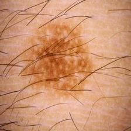
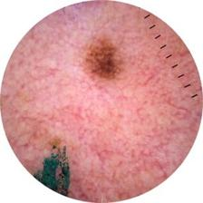

# Proposta
Neste documento é abordada a proposta de projeto da disciplina de Processamento Digital de Imagens.

## Problema

- O problema investigado consiste na dificuldade e na subjetividade inerentes à inspeção visual humana para a triagem inicial do melanoma, a forma mais letal de câncer de pele.

- **Por que envolve processamento de imagens:** O desafio exige a manipulação de matrizes de pixels brutas de fotografias dermatoscópicas, que frequentemente apresentam ruídos (como pelos sobrepostos e reflexos de iluminação) e transições de cor difusas. É necessário aplicar algoritmos matemáticos e morfológicos para limpar a imagem e isolar a região de interesse.

- Situação inicial: O sistema recebe como ponto de partida imagens coloridas (RGB) de lesões de pele, contendo tanto a anomalia (nevo ou melanoma) quanto a pele sadia ao redor, além de possíveis artefatos visuais.

- Informação produzida: O software deverá produzir, a partir da imagem original, o contorno exato da lesão (máscara de segmentação) e um conjunto de valores numéricos que representam descritores morfológicos (assimetria, compacidade, área) e cromáticos da mancha.

## Contexto de aplicação

A solução será aplicada no contexto de triagem clínica e auxílio ao diagnóstico dermatológico.

Como o melanoma possui alta taxa de cura quando detectado precocemente, mas compartilha características visuais muito sutis com pintas comuns (nevos benignos) em seus estágios iniciais, o software atuará como uma ferramenta de suporte à decisão ("segunda opinião computacional"). Embora não substitua a biópsia, o sistema processará grandes lotes de imagens padronizadas para fornecer aos profissionais de saúde dados quantitativos precisos que confirmem ou destaquem o polimorfismo, a assimetria e a heterogeneidade da lesão, otimizando o encaminhamento de pacientes para exames mais invasivos.

## Objetivo

**Objetivo Geral:**
Desenvolver um sistema automatizado capaz de segmentar lesões cutâneas em imagens dermatoscópicas digitais e extrair características quantitativas de forma e cor para viabilizar a diferenciação computacional entre nevos benignos e melanomas.

**Objetivos Específicos:**

 - Atenuar ruídos e remover computacionalmente artefatos da pele utilizando operações morfológicas. Algumas imagens possuem artefatos inesperados, distorção de lente e outros ruídos que precisam ser tratados antecipadamente, por exemplo:

<table align="center">
  <tr>
    <td align="center">
      
       
      <i>Exemplo de imagem com presença de pelos sobrepostos</i>
    </td>
    <td align="center">
      
       
      <i>Exemplo de imagem com distorção de lente e ruídos</i>
    </td>
  </tr>
</table>

 - Segmentar a área da lesão (frente) da pele sadia (fundo) aplicando técnicas de limiarização e detecção de contornos.

 - Calcular descritores matemáticos de forma da região segmentada (área, perímetro, compacidade de bordas e índices de assimetria).

 - Extrair métricas de dispersão cromática nos espaços de cor adequados para avaliar a heterogeneidade da mancha.

## Entrada e saída esperada

**Entrada:** Imagem (.jpg) colorida contendo lesões cutâneas benignas ou malignas, com resolução de $224 \times 224$ pixels.

**Saída esperada:** 
 - Imagem intermediária demonstrando o contorno traçado sobre a imagem original.

 - Vetor de características contendo os valores numéricos extraídos (assimetria, compacidade, área), que será utilizado por um modelo que irá classificar as lesões como benignas ou malignas.

**Pipeline conceitual:**

Imagem Dermatoscópica
   ↓
Pré-processamento
   ↓
Segmentação
   ↓
Extração de Características
   ↓
Geração do Vetor de Dados
   ↓
Classificação

## Referências
